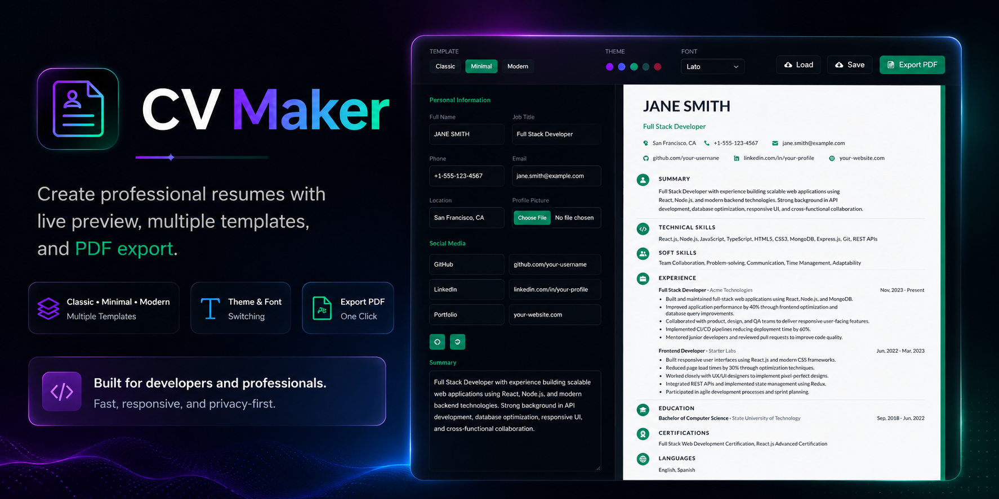

# CV Maker

A modern resume builder that helps you create professional, ATS-friendly resumes with live preview, multiple templates, theme and font customization, and one-click PDF export.

**Live Demo**: <a href="https://cv-maker-eight-red.vercel.app/" target="_blank">cv-maker-eight-red.vercel.app</a>

---

## Features

- **Live Preview** — See resume changes instantly as you type
- **3 Templates** — Classic, Minimal, and Modern layouts
- **5 Color Themes** — Fuchsia, Blue, Emerald, Slate, Rose
- **11 Fonts** — System and Google Fonts including Inter, Poppins, Merriweather, and more
- **Month/Year Date Picker** — Custom resume-friendly date selector with Present option
- **Inline Editing** — Edit achievement bullets directly in the preview
- **Drag and Drop** — Reorder work experience, projects, and skills sections
- **Rich Text Toolbar** — Bold, italic, underline, font size, and alignment
- **Save/Load Data** — Export and import resume data as JSON
- **PDF Export** — Download your resume as a clean A4 PDF
- **ATS Optimized** — Real text, standard sections, no hidden content

## Tech Stack

- **Next.js** — React framework
- **React** — UI components
- **Tailwind CSS** — Utility-first styling
- **React Beautiful DnD** — Drag and drop
- **React Icons** — Icon library
- **React Highlight Menu** — Text formatting toolbar

## Templates

| Template | Description |
|----------|-------------|
| **Classic** | Professional single-column layout with centered header, pipe-separated contact, and bottom-bordered section titles |
| **Minimal** | Clean, spacious layout with accent line, dot-separated contact, uppercase letter-spaced headings, and extra whitespace |
| **Modern** | Premium layout with left-bar accent header, two-column contact grid, date-left work entries, and bordered skill tags |

All templates support theme colors, font switching, and PDF export.

## Getting Started

### Prerequisites

- Node.js 14+
- npm, yarn, or pnpm

### Installation

```bash
git clone https://github.com/engmaryamameen/cv_maker.git
cd cv_maker
npm install
npm run dev
```

Open [http://localhost:3000](http://localhost:3000) in your browser.

## Available Scripts

| Command | Description |
|---------|-------------|
| `npm run dev` | Start development server |
| `npm run build` | Build for production |
| `npm run start` | Start production server |
| `npm run lint` | Run ESLint |

## Project Structure

```
cv_maker/
├── components/
│   ├── builder/          # BuilderHeader, PreviewPanel, TemplateSelector, ThemeSelector, FontSelector
│   ├── form/             # PersonalInformation, WorkExperience, Education, Projects, Skills, etc.
│   ├── preview/          # Legacy preview components
│   ├── templates/
│   │   ├── classic/      # ClassicTemplate
│   │   ├── minimal/      # MinimalTemplate
│   │   ├── modern/       # ModernTemplate
│   │   ├── shared/       # Shared section components and A4Wrapper
│   │   ├── registry.js   # Template registry
│   │   ├── themes.js     # Color themes
│   │   └── fonts.js      # Font options
│   └── utility/          # DefaultResumeData, DateRange, WinPrint
├── context/              # ResumeContext (state management)
├── hooks/                # useKeyboardShortcut
├── pages/                # Next.js pages (builder, index)
├── styles/               # Global CSS with Tailwind
└── public/               # Static assets
```

## PDF Export

The browser preview and exported PDF are designed to match exactly. When you click **Export PDF** or press `Ctrl+P`:

- Only the selected resume template is exported
- Builder controls, header toolbar, and form panel are hidden
- Theme colors and fonts are preserved
- A4 page size with 10mm margins is applied
- Background colors print correctly via `print-color-adjust: exact`

## Future Improvements

- Additional resume templates
- Custom section ordering
- Resume scoring and ATS analysis
- Cover letter builder
- User accounts and cloud storage
- Mobile-responsive builder layout

## Contributing

Contributions are welcome. Please open an issue first to discuss what you would like to change, then submit a pull request.

1. Fork the project
2. Create your feature branch (`git checkout -b feature/your-feature`)
3. Commit your changes (`git commit -m 'Add your feature'`)
4. Push to the branch (`git push origin feature/your-feature`)
5. Open a Pull Request

## License

This project is licensed under the MIT License. See the [LICENSE](LICENSE.md) file for details.

## Author

**Maryam Ameen**

- <a href="https://github.com/engmaryamameen" target="_blank">GitHub</a>
- <a href="https://www.linkedin.com/in/maryam-ameen" target="_blank">LinkedIn</a>
- <a href="mailto:eng.maryamameen@gmail.com">eng.maryamameen@gmail.com</a>
- <a href="https://www.upwork.com/freelancers/~maryamameen" target="_blank">Upwork</a>
